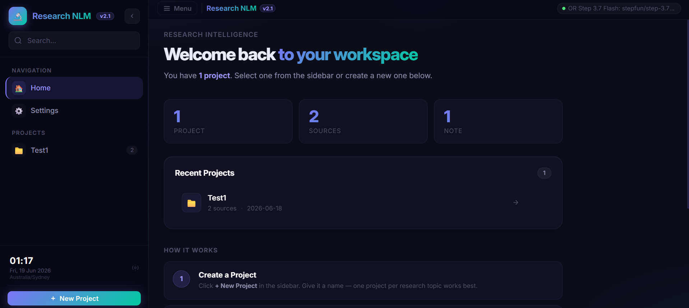
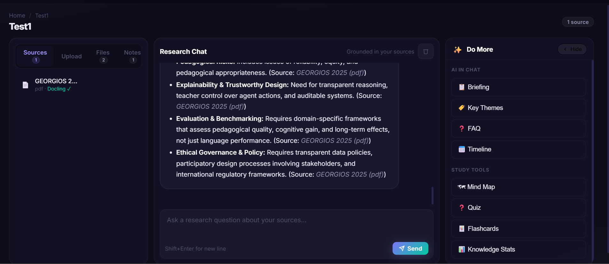
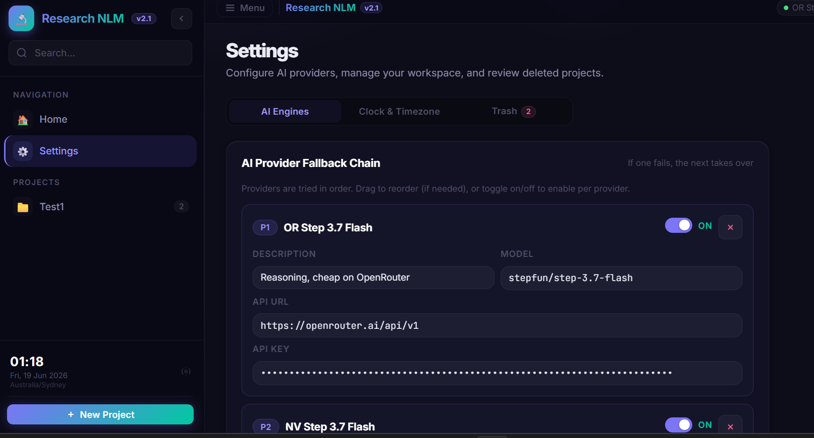

<div align="center">

# 📓 ResearchNotebookLLM V3.0.0

**Your private AI research assistant. Better than Google NotebookLM. Runs 100% on your machine.**

Upload PDFs · Paste URLs · Add YouTube · Ask questions grounded in your sources · 12-AI engine fallback


**[Features](#-features-in-detail) · [Quick Start](#-quick-start) · [Prerequisites](#-prerequisites) · [Security](#-security) · [License](#-license)**

</div>

---

## 📸 Screenshots

<table>
  <tr>
    <td align="center" width="50%">
      
      <br/><b>🏠 Home</b> — projects, stats, sidebar clock
    </td>
    <td align="center" width="50%">
      
      <br/><b>💬 Research Chat</b> — grounded AI answers from your docs
    </td>
  </tr>
  <tr>
    <td align="center" width="50%">
      
      <br/><b>📄 Sources</b> — PDFs, URLs and YouTube all in one place
    </td>
    <td align="center" width="50%">
      
      <br/><b>⚙️ Settings</b> — AI engines, timezone, configuration
    </td>
  </tr>
</table>

---

## ✨ Why ResearchNotebookLLM?

- **100% private:** your documents never leave your machine — not even for AI processing.
- **No subscription:** works with Ollama (free, local) or any OpenAI-compatible API you already have.
- **Works offline:** once set up, no internet required if you use a local model.
- **Multiple source types:** PDFs, web URLs, and YouTube videos all indexed and searchable.
- **12-engine AI fallback:** if one provider fails, the next takes over automatically — zero downtime.
- **Grounded answers:** every AI response is based strictly on your uploaded sources, not hallucinations.
- **ChromaDB vector search:** fast local semantic search across your entire document library.
- **Multi-notebook:** organise sources into separate notebooks per project or topic.

---

## 📋 Prerequisites

| Requirement | Minimum | Notes |
|---|---|---|
| Python | 3.10+ | 3.11 recommended |
| OS | Windows / macOS / Linux | Any platform Python runs on |
| RAM | 4 GB | 8 GB recommended for local AI |
| Disk | ~500 MB | More for large document libraries |
| AI (optional) | Any OpenAI-compatible API | Ollama works offline and is free |

---

## 🚀 Quick Start

### 1. Install Python

Skip if `python --version` already prints 3.10+. Otherwise download from [python.org](https://www.python.org/downloads/) and tick **"Add python.exe to PATH"** on Windows.

### 2. Clone the repository

```bash
git clone https://github.com/pavelblank/ResearchNotebookLLM.git
cd ResearchNotebookLLM
```

### 3. Install dependencies

```bash
pip install -r requirements.txt
```

### 4. Run the app

**Windows:** double-click `run.bat`

**macOS / Linux:**
```bash
python engine/app.py
```

### 5. Open in your browser

```
http://localhost:7860
```

### 6. Add an AI engine

Go to **Settings → AI Engines** and add your preferred provider:

| Engine | Notes |
|---|---|
| Ollama (local) | Free, runs offline. Install from [ollama.com](https://ollama.com) |
| OpenAI (GPT-4o) | Requires an API key |
| Anthropic (Claude) | Requires an API key |
| OpenRouter | Access 100+ models with one key |

---

## 🔥 Features in Detail

### 📄 Sources

- Upload **PDF** files directly from your computer.
- Paste any **web URL** — the page is fetched and indexed automatically.
- Add a **YouTube URL** — the transcript is extracted and indexed.
- All sources are chunked and stored in a local ChromaDB vector database.
- Delete individual sources at any time without affecting others.

### 💬 Research Chat

- Ask any question about your uploaded sources in plain English.
- Answers are grounded strictly in your indexed content — no hallucinations.
- Source citations included in every response so you know exactly where the answer came from.
- Chat history persisted locally between sessions.

### 🔗 12-Engine AI Fallback

- Connect up to 12 AI providers simultaneously.
- Priority-based routing: engines are tried in order, soft failures trigger automatic failover.
- Local Ollama is the final offline fallback — research never stops.

### 📚 Multi-Notebook

- Create separate notebooks per project, paper set, or topic.
- Each notebook has its own isolated vector store and chat history.
- Switch between notebooks instantly without reloading.

### ⚙️ Settings

- Add, edit, reorder and enable/disable AI engines.
- Set your timezone for accurate timestamps.
- All configuration stored locally — no cloud sync.

---

## 📁 Project Structure

```
ResearchNotebookLLM/
├── engine/
│   └── app.py              # Flask app: routes, API, vector search
├── requirements.txt
├── run.bat                 # Windows launcher
├── docs/
│   └── screenshots/        # README screenshots
├── data/                   # Auto-created (gitignored)
│   ├── chroma/             # ChromaDB vector store
│   └── notebooks/          # Notebook metadata
└── README.md
```

---

## 🔒 Security

- **All data is local:** documents, vectors, chat history and AI keys are stored only on your machine.
- **No telemetry:** zero external calls except to whichever AI provider you configure.
- **API keys in Settings only:** never hardcoded in source files.
- **Localhost binding:** the server binds to `127.0.0.1` by default — not exposed to your network.

> Do not expose this app to the public internet without a reverse proxy and HTTPS.

---

## 🔄 Updating

```bash
git pull
pip install -r requirements.txt --upgrade
```

Restart the app afterwards.

---

## 🤖 Built With AI

ResearchNotebookLLM was built entirely using **Claude Code** (Anthropic), demonstrating that a production-grade private AI research assistant can be created through AI-assisted development with no traditional software background required.

---

## 📜 License

Apache License 2.0 · MIT License. Free to use, modify and distribute. See [LICENSE](LICENSE) for details.

---

<div align="center">

*Self-hosted. Local-first. Your research, your machine, your keys.*

</div>
